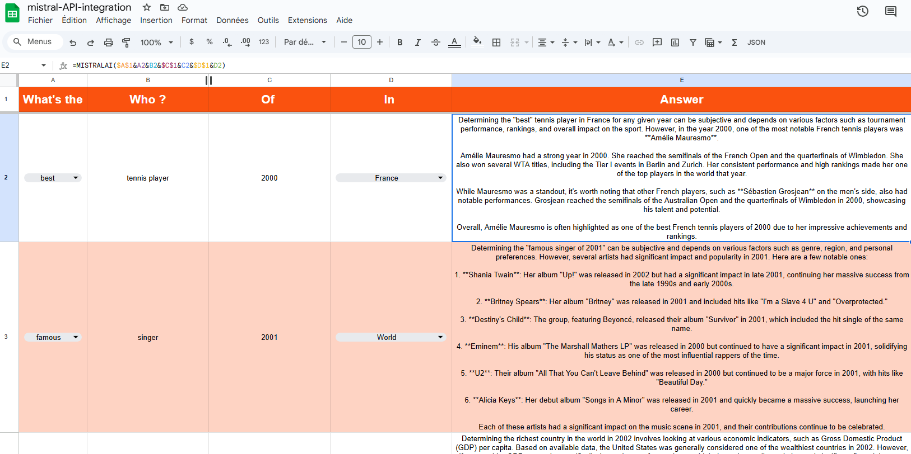

# Google Sheets Mistral AI Integration

This repository contains a Google Apps Script that integrates Mistral AI with Google Sheets. It allows you to call the Mistral AI API directly from a Google Sheet using a custom function / formula.

---

## Features

- **Custom Function**: Use the `MISTRALAI` function in Google Sheets to generate text based on a prompt.
- **Dynamic Parameters**: Adjust `maxTokens`, `temperature`, and `model` directly from your Google Sheet.
- **Easy Integration**: Simple setup to start using Mistral AI within Google Sheets.

## Setup

1. **Create a Google Apps Script Project**:
   - Open your Google Sheet.
   - Go to `Extensions` > `Apps Script`.

2. **Add the Script**: `Code.gs`

3. **Save and Authorize**:
   - Save the script with a suitable name.
   - Authorize the script to run by following the prompts.

4. **Set Your API Token**:
   - Replace `'YOUR_MISTRAL_API_TOKEN'` with your actual Mistral API token.

## Usage
   - In any cell in your Google Sheet, use the formula `=MISTRALAI("Your prompt here")`.
   - You can also specify optional parameters: `=MISTRALAI("Your prompt here", 150, 0.7, "mistral-model")`.

## Example
To generate a short sentence about the best French painter, you can use:

=MISTRALAI("Who is the best French painter? Answer in one short sentence.")

This will call the Mistral AI API and return a generated response directly in your Google Sheet.